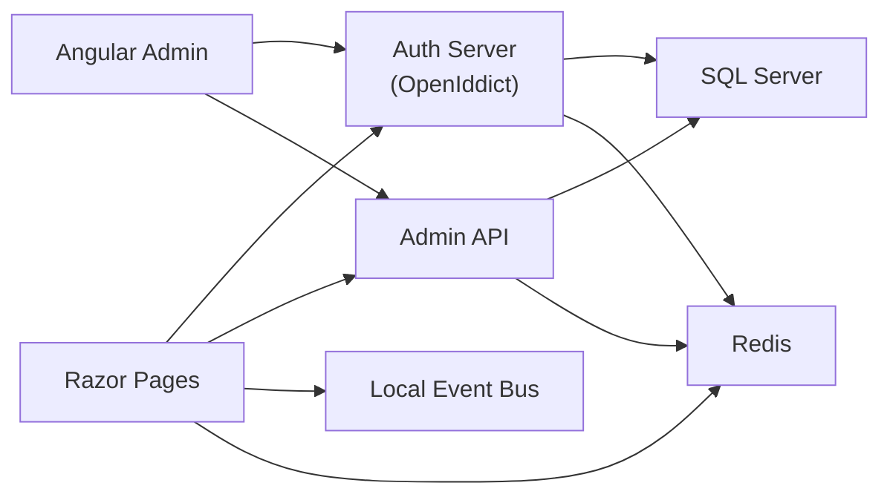

## Project Overview

MyEcommerce is a personal learning project built to explore modern ASP.NET Core application architecture with the ABP Framework. It is not production-ready and is intended to demonstrate knowledge of modular design, OpenIddict-based authentication, authorization, dependency injection, Entity Framework Core, Razor Pages, Angular, distributed caching, a local event bus, and session-based shopping cart flows.

## Learning Objectives

- Understand ABP modular architecture and layered application design.
- Explore OpenIddict and OpenID Connect authentication flows.
- Implement cookie-based Razor Pages authentication and JWT bearer API access.
- Configure Entity Framework Core with SQL Server migrations.
- Use Redis for distributed cache
- Build a session-backed shopping cart in ASP.NET Core Razor Pages.
- Publish local events with ABP `ILocalEventBus` and handle them with event handlers.
- Consume APIs and manage tokens from an Angular admin application.

## Current Features

- Auth server with ABP account and OpenIddict support.
- Public Razor Pages website with product catalog, cart, checkout, and authentication via OpenID Connect.
- Angular admin UI that obtains tokens from the auth server using the Resource Owner Password Credentials (password) grant, stores tokens in browser session storage, and supports refresh token handling via an HTTP interceptor.
- Admin HTTP API host protected by JWT bearer authentication.
- SQL Server-backed domain model using EF Core with migrations.
- Redis-based distributed caching.
- ASP.NET Core session-backed shopping cart stored in session state.
- Local event bus publishing of `NewOrderCreatedEvent` during checkout.
- Email event handler that renders templates and sends order confirmation emails.
- Swagger UI for the admin API with OAuth integration.

## Architecture

The repository is organized as a layered ABP solution.



### Applications in the solution

- `MyEcommerce.AuthServer` — Auth server and OpenIddict issuer.
- `MyEcommerce.Public.Web` — Public-facing Razor Pages website, shopping cart, checkout, and OpenID Connect login.
- `MyEcommerce.Admin.HttpApi.Host` — Admin API host protected by JWT and exposing the HTTP API.
- `MyEcommerce.DbMigrator` — Console migration runner for database schema updates.
- `angular/` — Angular admin UI that calls the admin API and authenticates with the auth server.
- `common/domain` — Domain and shared domain logic.
- `common/infrastructure` — EF Core infrastructure, repository, migrations, and seeding.

## Technology Stack

| Technology                  | Purpose                           | Version                                                     |
| --------------------------- | --------------------------------- | ----------------------------------------------------------- |
| .NET                        | Application runtime               | `net10.0`                                                   |
| ABP Framework               | Modular app foundation            | `10.3.0`                                                    |
| Angular                     | Admin SPA                         | `21.2.0`                                                    |
| TypeScript                  | Frontend language                 | `5.9.3`                                                     |
| SQL Server                  | Database provider                 | `Microsoft.EntityFrameworkCore.SqlServer 10.3.0`            |
| Redis                       | Distributed cache                 | configured via application settings (`Redis:Configuration`) |
| Serilog                     | Application logging               | `9.0.0`                                                     |
| OpenIddict / OpenID Connect | Authentication & token validation | ABP OpenIddict modules                                      |

## Authentication & Authorization

### OpenIddict

- `MyEcommerce.AuthServer` configures OpenIddict with local server validation and ABP account integration.
- The auth server is the identity provider and token issuer for the admin API and public site.
- In production mode, the code is designed to use `openiddict.pfx` certificates for signing and encryption.

### Razor login flow

- `MyEcommerce.Public.Web` uses cookie authentication as the default scheme.
- It challenges users with OpenId Connect and redirects to the auth server for login.
- `Login.cshtml.cs` issues the login challenge and `Logout.cshtml.cs` signs the user out from cookies and OpenId Connect.

### Angular login flow

- The Angular app uses a custom auth service (`auth.service.ts`) that POSTs form-encoded credentials to the auth server's `connect/token` endpoint using `grant_type=password` (Resource Owner Password Credentials).
- Access and refresh tokens are persisted to browser session storage via `TokenStorageService`.
- `TokenInterceptor` attaches `Authorization: Bearer` to outgoing requests and handles `401` responses by using the refresh token flow to obtain a new access token and retry the failed request.
- Note: `provideAbpOAuth()` is included in the app providers, but the implemented login flow uses the token endpoint directly rather than an OAuth2 authorization code redirect/PKCE flow.

### JWT / policy authorization

- `MyEcommerce.Admin.HttpApi.Host` validates JWT bearer tokens from the auth server.
- The admin API sets up an `AdminOnly` authorization policy requiring an Admin role.
- The public site also enables dynamic claims via ABP and can use claim-based authorization in Razor pages.

## Caching

- Redis is integrated through the ABP `AbpCachingStackExchangeRedisModule`.
- Distributed cache keys are prefixed with `MyEcommerce:`.
- Redis is also used for distributed locking via `RedisDistributedSynchronizationProvider`.

## Event Bus

- The public checkout flow publishes `NewOrderCreatedEvent` to ABP’s local event bus.
- `SendMailtoCustomerEventHandler` handles this event and sends an email using `IEmailSender` and template rendering.
- This demonstrates ABP local event handling, not a distributed event bus implementation.

## Shopping Cart

- The shopping cart is implemented in `MyEcommerce.Public.Web` using ASP.NET Core `ISession`.
- Cart items are serialized into session state and reconstructed on cart and checkout pages.
- Advantages:
  - Simple to implement for a learning project.
  - No database schema changes required for cart state.
- Limitations:
  - Cart data is temporary and tied to server session state.
  - It is not persisted across browser sessions or shared across devices.
  - It depends on session storage and is not suitable for production-level cart persistence.

## Database

- The application uses SQL Server through EF Core and ABP’s SQL Server provider.
- Migrations are stored under `aspnet-core/src/common/infrastructure/MyEcommerce.EntityFrameworkCore/Migrations`.
- There are also SQL schema scripts in `aspnet-core/database/schemas` for initial schema setup.
- The `MyEcommerce.DbMigrator` app exists to apply migrations and seed initial data.

## Solution Structure

```
MyEcommerce
├── angular
│   ├── package.json
│   ├── yarn.lock
│   ├── src
│   └── README.md
├── aspnet-core
│   ├── MyEcommerce.slnx
│   ├── common.props
│   ├── database
│   │   └── schemas
│   ├── src
│   │   ├── admin
│   │   │   ├── MyEcommerce.Admin.HttpApi.Host
│   │   │   ├── MyEcommerce.Admin.HttpApi
│   │   │   ├── MyEcommerce.Admin.Application
│   │   │   └── MyEcommerce.Admin.Application.Contracts
│   │   ├── auth
│   │   │   └── MyEcommerce.AuthServer
│   │   ├── public
│   │   │   ├── MyEcommerce.Public.Web
│   │   │   ├── MyEcommerce.Public.HttpApi
│   │   │   ├── MyEcommerce.Public.Application
│   │   │   └── MyEcommerce.Public.Application.Contracts
   │   └── common
   │       ├── domain
   │       │   ├── MyEcommerce.Domain
   │       │   └── MyEcommerce.Domain.Shared
   │       └── infrastructure
   │           ├── MyEcommerce.EntityFrameworkCore
   │           └── MyEcommerce.DbMigrator
   └── test
```

## Prerequisites

- .NET 10 SDK
- Node.js 20.11+ and npm or Yarn
- SQL Server accessible from `Server=.;Database=MyEcommerce` or updated connection strings
- Redis running on `localhost:6379`
- (Optional) `@angular/cli` or use `npx ng` via npm scripts

## Installation

1. Restore .NET packages:
   ```bash
   dotnet restore aspnet-core\MyEcommerce.slnx
   ```
2. Install frontend dependencies:
   ```bash
   cd angular
   yarn install
   # or npm install
   ```
3. Ensure Redis is running locally.
4. Ensure SQL Server is available and credentials in `appsettings.json` are valid.

## Configuration

The following files contain important runtime settings:

- `aspnet-core/src/auth/MyEcommerce.AuthServer/appsettings.json`
- `aspnet-core/src/admin/MyEcommerce.Admin.HttpApi.Host/appsettings.json`
- `aspnet-core/src/public/MyEcommerce.Public.Web/appsettings.json`
- `angular/src/environments/environment.ts`
- `angular/src/environments/environment.prod.ts`

Key settings to review:

- `ConnectionStrings:Default` — SQL Server database connection.
- `Redis:Configuration` — Redis endpoint and password.
- `AuthServer:Authority` — auth server base URL.
- `AuthServer:ClientId` / `ClientSecret` — public web client credentials.
- `SwaggerClientId` — admin API Swagger OAuth client.
- `App:SelfUrl` / `App:ClientUrl` — site URLs used by ABP.

## Running the Project

### 1. Apply migrations

```bash
dotnet run --project aspnet-core\src\common\infrastructure\MyEcommerce.DbMigrator\MyEcommerce.DbMigrator.csproj
```

### 2. Start the auth server

```bash
dotnet run --project aspnet-core\src\auth\MyEcommerce.AuthServer\MyEcommerce.AuthServer.csproj
```

### 3. Start the admin API host

```bash
dotnet run --project aspnet-core\src\admin\MyEcommerce.Admin.HttpApi.Host\MyEcommerce.Admin.HttpApi.Host.csproj
```

### 4. Start the public Razor site

```bash
dotnet run --project aspnet-core\src\public\MyEcommerce.Public.Web\MyEcommerce.Public.Web.csproj
```

### 5. Start the Angular admin UI

```bash
cd angular
yarn start
# or npm start
```

## Default URLs

| Application      | URL                      |
| ---------------- | ------------------------ |
| Auth Server      | `https://localhost:5000` |
| Admin API Host   | `https://localhost:5001` |
| Public Razor Web | `https://localhost:6001` |
| Angular Admin UI | `http://localhost:4200`  |

## What I Learned

This repository demonstrates:

- ABP modular application patterns and layered architecture.
- OpenIddict and OpenID Connect integration in ASP.NET Core.
- Razor Pages authentication and session handling.
- Angular token-based API consumption with refresh token flow.
- EF Core migrations and SQL Server persistence.
- Redis-based distributed caching and locking.
- Local event bus processing for asynchronous application events.

## Current Limitations

- Not production-ready; this is a learning/demo implementation.
- No Docker or container orchestration support is included.
- Shopping cart is stored in session and is not persisted to a database.
- Production certificate and secret management are not configured by default.
- Email delivery and SMTP credentials are configured for testing and may need adjustment.
- Admin policy and roles are basic; permission enforcement is minimal.

## Future Improvements

- Add Docker support for SQL Server, Redis, and application services.
- Persist cart state to the database for a durable shopping experience.
- Harden OpenIddict production certificate and secret management.
- Improve admin UI role/permission enforcement.
- Add end-to-end tests and CI pipeline scripts.
- Add more realistic order history, product management, and admin dashboards.
